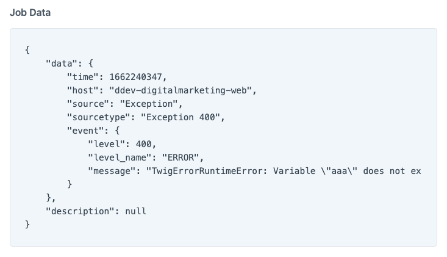

Simple Logger plugin for Craft CMS
===

Plugin for collecting exception handlers logs and reporting

_Powered by https://github.com/Seldaek/monolog_

### Install

```bash
composer require leowebguy/simple-logger && php craft plugin/install simple-logger
```

### Usage



### Feeling creative?

PR into https://github.com/leowebguy/simple-logger
