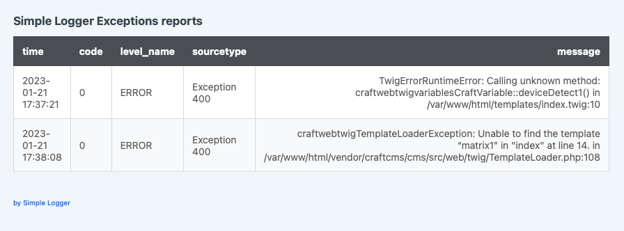

Simple Logger plugin for Craft CMS
===

Plugin for collecting exception handlers logs and reporting over email.
A simple solution for those who can't or won't pay for corporate solution loggers like: New Relic, Dynatrace, Datadog and others.

### If you don't receive daily emails, check:

1. if your email setup is correct
2. if simple logger plugin is active
3. if you have exceptions older than a day in `storage/logs/simplelogger.json`

### Install

```bash
composer require leowebguy/simple-logger && php craft plugin/install simple-logger
```

### Usage

Set these two `.env` parameters to make sure Simple Logger is active

```dotenv
# Simple Logger
LOGGER_ON=1
LOGGER_EMAIL=john@email.com
```

`LOGGER_EMAIL` accept multiple emails `LOGGER_EMAIL=john@email.com,jane@@email.com`

The plugin will use the built-in craft event `EVENT_BEFORE_HANDLE_EXCEPTION` to handle
exceptions, saving into a custom log file `storage/logs/simplelogger.json`

```log
[
    {
        "time": "2023-01-21 17:37:21",
        "sourcetype": "Exception 400",
        "level_name": "ERROR",
        "message": "TwigErrorRuntimeError: Calling unknown method: craftwebtwigvariablesCraftVariable::deviceDetect1() in /var/www/html/templates/index.twig:10"
    }
]
```

Using the same event above, Simple Logger will once a day (after 8pm) collect the report and send an email to `LOGGER_EMAIL` defined recipient



Simple Logger won't collect `NotFoundHttpException` exceptions, mostly related to inexistent pages or resources

### Feeling creative?

PR into https://github.com/leowebguy/simple-logger
